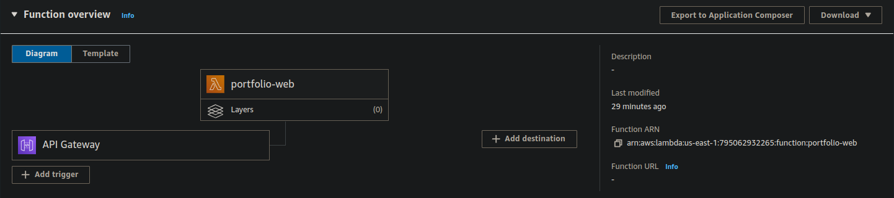
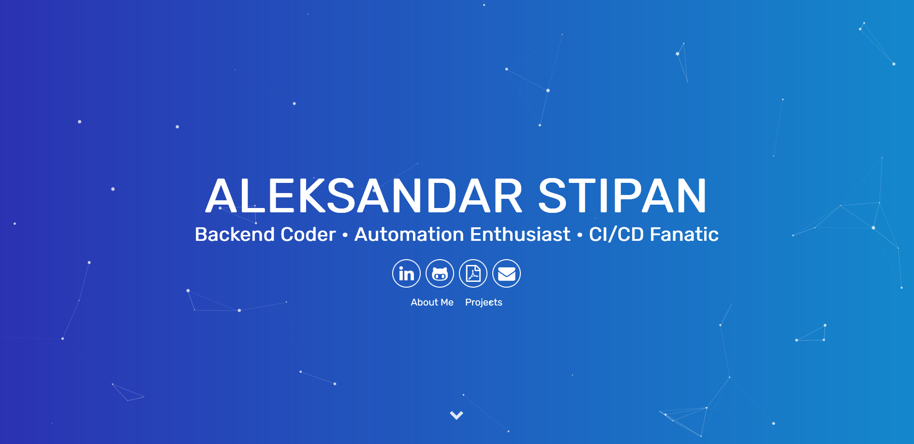

# Portfolio Website

This static website is built with Go and Templ and deployed on AWS Lambda with Terraform.

Complete website in singe binary.

## Deployment

First, build the binary for the Lambda function, which will later be zipped and uploaded with Terraform:

```bash
make build
```

cd into aws-infra and run terraform apply:

```bash
cd aws-infra
terraform init
terraform apply
```

output will provide the URL to the website:

```bash
Outputs:

api_gateway_url = {
  "value" = "https://dx90b08zwj.execute-api.us-east-1.amazonaws.com"
}
lambda_arn = {
  "invoke_arn" = "arn:aws:apigateway:us-east-1:lambda:path/2015-03-31/functions/arn:aws:lambda:us-east-1:795062932265:function:portfolio-web/invocations"
  "lambda_arn" = "arn:aws:lambda:us-east-1:795062932265:function:portfolio-web"
  "lambda_name" = "portfolio-web"
}
```

Two main resources are created:

Lambda function and API Gateway



Destroy infrastructure:

```bash
terraform destroy
```

## MakeFile

```bash
all: build

build:
	@echo "Building..."
	@if command -v templ > /dev/null; then \
			templ generate; \
	else \
		read -p "Go's 'templ' is not installed on your machine. Do you want to install it? [Y/n] " choice; \
		if [ "$$choice" != "n" ] && [ "$$choice" != "N" ]; then \
			go install github.com/a-h/templ/cmd/templ@latest; \
			templ generate; \
		else \
			echo "You chose not to install templ. Exiting..."; \
			exit 1; \
		fi; \
	fi
	@GOOS=linux GOARCH=amd64 go build -o bootstrap cmd/api/main.go

clean:
	@echo "Cleaning..."
	@rm -f bootstrap

.PHONY: all build clean
```


