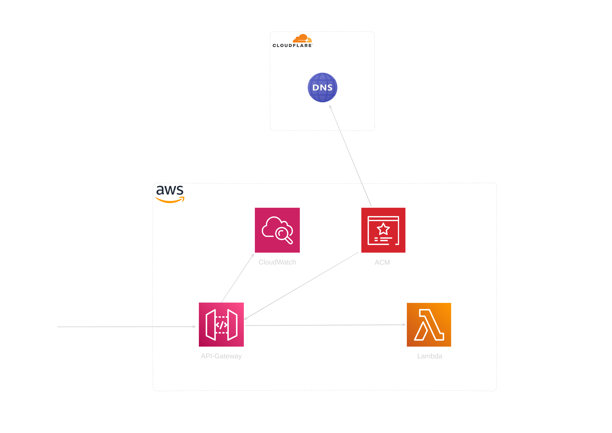

# Portfolio Website

This static website is built with Go and Templ, deployed on AWS Lambda with Terraform, and is accessible via a Cloudflare custom domain.

Complete website in singe binary.

## Deployment

First, build the binary for the Lambda function, which will later be zipped and uploaded with Terraform:

```bash
make build
```
On Cloudflare, create an API key that can write DNS records. Along with the specific Cloudflare zone ID for the domain, import the credentials into the .auto.tfvars file:

```bash
cloudflare_api_token = "xxxxxxxxxxxxxxxxxxxxxxxxxxxxxxxx"
cloudflare_zone_id   = "xxxxxxxxxxxxxxxxxxxxxxxxxxxxxxxx"
```
Run terraform commands:

```bash
terraform init
terraform apply
```
Three main resources are created:

Lambda function, an API Gateway, a certificate in ACM, and an updated Cloudflare domain entry.



Destroy infrastructure:

```bash
terraform destroy
```

## MakeFile

```bash
all: build

build:
	@echo "Building..."
	@if command -v templ > /dev/null; then \
			templ generate; \
	else \
		read -p "Go's 'templ' is not installed on your machine. Do you want to install it? [Y/n] " choice; \
		if [ "$$choice" != "n" ] && [ "$$choice" != "N" ]; then \
			go install github.com/a-h/templ/cmd/templ@latest; \
			templ generate; \
		else \
			echo "You chose not to install templ. Exiting..."; \
			exit 1; \
		fi; \
	fi
	@GOOS=linux GOARCH=amd64 go build -o bootstrap cmd/api/main.go

clean:
	@echo "Cleaning..."
	@rm -f bootstrap

.PHONY: all build clean
```
